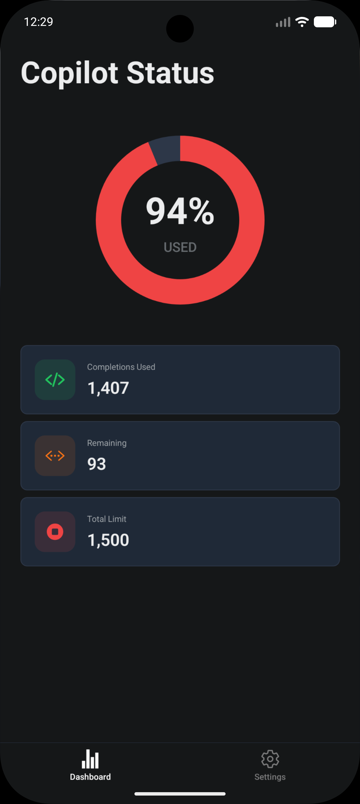
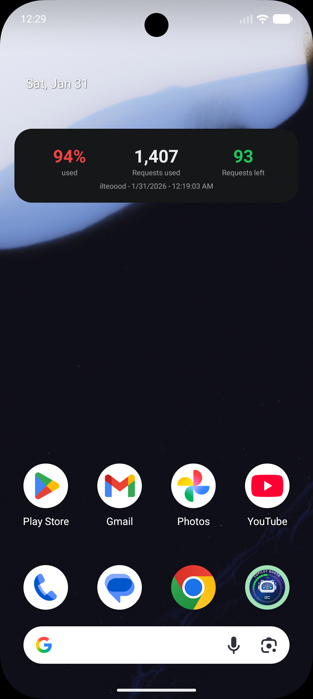

# Copilot Status

A mobile-only app to monitor your GitHub Copilot usage quota with native home screen widgets for iOS and Android.

## Features

- **GitHub OAuth Authentication** - Secure sign-in with your GitHub account
- **Real-time Quota Dashboard** - View your Copilot usage with visual progress indicators
- **Native Widgets** - Home screen widgets for iOS (WidgetKit) and Android
- **Offline Support** - Cached data available when offline

## Screenshots

### Dashboard



### Widget



## Prerequisites

- Node.js 24+
- Expo CLI (`npm install -g expo-cli`)
- iOS: Xcode 15+ (for iOS development)
- Android: Android Studio (for Android development)

## Setup

### 1. Clone and Install

```bash
git clone https://github.com/ilteoood/copilot-status.git
cd copilot-status
npm install
```

### 2. Environment Variables

Create a `.env` file in the project root:

```env
GITHUB_CLIENT_ID=your_github_oauth_client_id
GITHUB_CLIENT_SECRET=your_github_oauth_client_secret
```

To get these credentials:

1. Go to [GitHub Developer Settings](https://github.com/settings/developers)
2. Create a new OAuth App
3. Set the callback URL to: `xyz.ilteoood.copilotstatus://oauth`

### 3. iOS Setup

For iOS widgets to work, you need to:

1. Open the project in Xcode after running `npx expo prebuild`
2. Set your Apple Team ID in `targets/widget/expo-target.config.json`
3. Enable the App Groups capability for both the main app and widget extension
4. Use the App Group: `group.xyz.ilteoood.copilotstatus`

### 4. Run the App

```bash
# Development
npx expo start

# iOS (requires Mac)
npx expo run:ios

# Android
npx expo run:android
```

## Project Structure

```
copilot-status/
├── app/                      # Expo Router screens
│   ├── (auth)/              # Authentication flow
│   │   └── login.tsx        # GitHub OAuth login
│   └── (tabs)/              # Main app tabs
│       ├── index.tsx        # Dashboard
│       └── settings.tsx     # Settings & sign out
├── components/              # Reusable UI components
│   ├── CircularProgress.tsx # Animated progress ring
│   ├── QuotaDisplay.tsx     # Main quota UI
│   ├── StatsCard.tsx        # Statistics display
│   └── CachedBanner.tsx     # Offline indicator
├── services/                # Business logic
│   ├── api.ts               # GitHub Copilot API
│   ├── auth.ts              # OAuth authentication
│   ├── storage.ts           # MMKV persistence
│   └── widgetSync.ts        # Widget data sync
├── stores/                  # Zustand state management
│   ├── auth.ts              # Auth state
│   └── quota.ts             # Quota state
├── widgets/                 # Android widget
│   ├── CopilotWidget.tsx    # Widget UI
│   └── widgetTaskHandler.tsx
├── targets/widget/          # iOS WidgetKit
│   └── index.swift          # SwiftUI widget
├── types/                   # TypeScript types
└── constants/               # App constants
```

## Tech Stack

- **Framework**: Expo SDK 54 + React Native
- **Navigation**: Expo Router
- **State Management**: Zustand with MMKV persistence
- **Authentication**: expo-auth-session (OAuth 2.0)
- **Widgets**: vultra

## License

MIT
